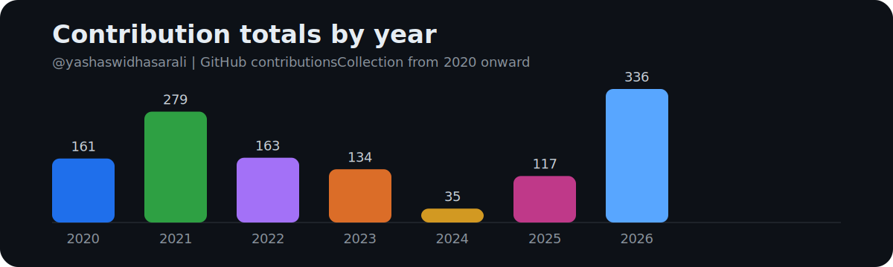
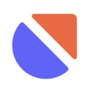
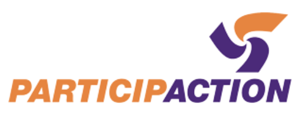
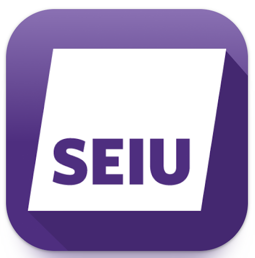

<h1 align="center">Yashaswi Hasarali</h1>
<h3 align="center">AI Engineer | Full Stack Product Engineer for SaaS Platforms</h3>

  
  
  

  <strong>San Jose, CA</strong> • Open to software engineering, full-stack, platform, and AI application roles

  I build AI-powered SaaS products with <strong>LLM</strong>, <strong>LangGraph</strong>, <strong>Python</strong>, <strong>React</strong>, and <strong>AWS</strong>.

## At a Glance

- 5+ years building AI-powered SaaS products, MVPs, internal tools, and customer-facing platforms
- Core contributor at `Grantify` across funding intelligence, onboarding flows, dashboards, and automation
- Strong across product engineering, backend systems, data workflows, and LLM application development

## What I Work On

- AI modules and intelligent product features for SaaS platforms
- Full-stack SaaS products and internal dashboards
- AI-assisted user experiences and workflow automation
- Scalable backend systems on AWS
- Data ingestion, matching, and intelligence platforms

## Highlights

- Built AI modules for production SaaS products using `LangChain`, `LangGraph`, `OpenAI`, and `Pinecone`, including semantic retrieval, intelligent parsing, and context-aware answers across 12+ file formats
- Shipped AI-powered workflows on `AWS` with queue-based processing and serverless orchestration for scalable product experiences
- Led prompt engineering and model iteration for live AI features, improving answer quality and reducing hallucinations through benchmark-driven evaluation
- Integrated `Langfuse` for observability, prompt versioning, and faster iteration on customer-facing AI systems
- Developed AI-assisted writing and transcription workflows using `OpenAI` and `AssemblyAI` for real product use cases
- Contributed to a funding intelligence platform combining backend services, LLM scoring, business rules, and product UX to rank relevant opportunities
- Delivered React-based onboarding flows, user dashboards, internal sales tools, analytics integrations, and end-to-end product experiences
- Built ingestion and automation pipelines for scraping, normalization, deduplication, alerting, and downstream business workflows

## GitHub Analytics

<table>
  <tr>
    <td align="center" width="100%">
      <strong>Profile Summary</strong>  
      
    </td>
  </tr>
</table>

<table>
  <tr>
    <td align="center" width="100%">
      <strong>Contribution Streak</strong>  
      
    </td>
  </tr>
</table>

<table>
  <tr>
    <td align="center" width="100%">
      <strong>Recent Contribution Activity</strong>  
      
    </td>
  </tr>
</table>

<table>
  <tr>
    <td align="center" width="100%">
      <strong>Contribution Totals by Year</strong>  
      
    </td>
  </tr>
</table>

## Experience

###  `Grantify` | Full Stack Engineer
`May 2023 - Present` | `San Jose, CA`

- Built AI modules for production SaaS products using `LangChain`, `LangGraph`, `OpenAI`, and `Pinecone`, enabling intelligent parsing, semantic retrieval, and context-aware answers across 12+ file formats
- Shipped serverless AI workflows on `AWS Lambda` with `SQS`-driven bulk processing, queue-based orchestration, and scalable document-processing pipelines
- Led prompt engineering and model iteration for live AI features, improving answer quality and reducing hallucinations through benchmark-driven evaluation on real customer datasets
- Integrated `Langfuse` for end-to-end observability, prompt versioning, trace monitoring, and cost tracking across production AI systems
- Built AI-assisted writing and transcription workflows using `OpenAI` and `AssemblyAI` for real customer-facing product experiences
- Contributed to a funding intelligence platform that combined backend services, LLM scoring, business rules, and product UX to rank relevant opportunities
- Developed ingestion and automation pipelines with scraping, normalization, deduplication, change analysis, and downstream alerting workflows
- Delivered customer onboarding, company and project profiling, internal sales tooling, dashboards, and authenticated product experiences using `React`, `TypeScript`, `Vite`, `TanStack`, `Tailwind CSS`, and `tRPC`

###  `SUNY Research Foundation` | Senior Research Aide
`Mar 2023 - May 2024` | `Binghamton, NY`

- Utilized `Bonsai` to acquire and process data from connected hardware devices, enabling real-time capture of behavioral measures and derived quantitative metrics
- Developed and maintained data acquisition workflows to ensure reliable, continuous, and synchronized recording across multiple data sources
- Implemented data processing pipelines that transformed raw device outputs into structured datasets suitable for downstream statistical analysis
- Ensured data integrity through validation, quality checks, and troubleshooting of device and software configurations
- Contributed to research infrastructure by integrating diverse devices into a unified data-capture framework and documenting processes for reproducibility

###  `Binghamton University` | Graduate Teaching Assistant
`Sep 2022 - May 2023` | `Binghamton, NY`

- Supported and guided undergraduate and graduate students in `Essentials of Programming - Python`, reinforcing core programming concepts through assignments and lecture materials
- Assisted in developing, clarifying, and presenting course content covering Python syntax, data structures, and problem-solving techniques
- Held regular office hours to provide one-on-one and small-group support for debugging, assignments, and conceptual questions
- Evaluated assignments, projects, and exams for a cohort of 70 students while providing detailed feedback on code quality, style, and efficiency
- Monitored student performance and contributed to an organized workflow for grading, course records, and timely reporting of results

###  `Exathought Technology Pvt Ltd` | Software Engineer
`Jul 2019 - Jul 2022` | `Bengaluru, India`

- Built 5 MVP SaaS and mobile products using `React.js`, `React Native`, and `Flutter`, helping turn startup concepts into usable customer-facing applications
- Architected product structures and database schemas aligned with industry standards for scalable, secure, and maintainable software delivery
- Designed and optimized infrastructure and routing approaches to improve application performance, reliability, and overall user experience
- Implemented advanced application features and algorithms that improved responsiveness, stability, and product usability across web and mobile builds
- Mentored junior engineers, promoted code quality and collaborative problem-solving, and contributed to stronger delivery standards across the team
- Continuously evaluated emerging tools and frameworks and integrated relevant innovations into product engineering and platform workflows

## Tech Stack

**Languages**  
`Python` `JavaScript` `TypeScript` `Java` `Kotlin` `Dart` `SQL`

**AI and Data**  
`OpenAI` `Claude` `LangChain` `LangGraph` `Pinecone` `Langfuse` `RAG` `Prompt Engineering` `Semantic Search` `OCR` `ETL` `Apache Airflow` `Pandas` `NumPy`

**Frontend**  
`React` `React Native` `Flutter` `Next.js` `Vite` `Tailwind CSS` `TanStack Query` `TanStack Table` `TanStack Form` `Zod` `Redux`

**Backend and APIs**  
`Python` `Node.js` `Express.js` `Django` `tRPC` `REST APIs` `GraphQL` `PostgreSQL` `MySQL` `MongoDB` `DynamoDB` `BigQuery` `Elasticsearch`

**Cloud and DevOps**  
`AWS Lambda` `ECS` `CDK` `SQS` `Cognito` `API Gateway` `CloudWatch` `IAM` `CloudFront` `Docker` `GitHub Actions` `Jenkins` `CI/CD` `Firebase`

**Testing and Quality**  
`Playwright` `Pytest` `Jest` `Vitest` `JUnit` `MyPy` `TDD`

## Featured Product Builds

<table>
  <tr>
    <td width="120" valign="top">
      
    </td>
    <td valign="top">
      <strong>AI Document Parsing</strong> · AI module for client document understanding 
      Reads client documents and answers questions grounded in uploaded content. 
      <code>OpenAI API</code><code>LangGraph</code> <code>LangChain</code> <code>Langfuse</code> <code>RAG</code> <code>Pinecone</code> <code>Python</code> <code>AWS</code>
    </td>
  </tr>
  <tr>
    <td width="120" valign="top">
      
    </td>
    <td valign="top">
      <strong>Call Transcription</strong> · AI module for automated call transcription 
      Processes call recordings and generates searchable transcripts automatically. 
      <code>AssemblyAI</code> <code>Zoom Recordings</code> <code>Pinecone</code> <code>AWS</code>
    </td>
  </tr>
  <tr>
    <td width="120" valign="top">
      
    </td>
    <td valign="top">
      <strong>AI Writing Assistant</strong> · AI module for guided answers and rephrasing 
      Helps users rephrase responses, retrieve context, and interact with domain knowledge like a chat assistant. 
      <code>OpenAI API</code> <code>LangChain</code> <code>Langfuse</code> <code>RAG</code> <code>Pinecone</code> <code>Python</code> <code>AWS</code>
    </td>
  </tr>
  <tr>
    <td width="120" valign="top">
      
    </td>
    <td valign="top">
      <strong>Funding Services</strong> · SaaS application for finding and matching funding opportunities 
      Helps users discover relevant funding opportunities and match against business context. 
      <code>OpenAI</code> <code>Perplexity API</code> <code>React</code> <code>Node.js</code> <code>Python</code> <code>AWS</code>
    </td>
  </tr>
  <tr>
    <td width="120" valign="top">
      
    </td>
    <td valign="top">
      <strong>ParticipACTION</strong> · Fitness challenge Android application 
      <a href="https://www.participaction.com/">Website</a> 
      Upgraded an Android <code>Kotlin</code> app with new challenge flows and fitness tracking integrations, improving responsiveness and overall product UX.
    </td>
  </tr>
  <tr>
    <td width="120" valign="top">
      
    </td>
    <td valign="top">
      <strong>Unity - Hard Rock Cafe</strong> · Loyalty and rewards mobile experience 
      <a href="https://play.google.com/store/apps/details?id=com.shre.unitymobile.prod&hl=en_US">Google Play</a> 
      Spearheaded a <code>React Native</code> application for loyalty workflows and user engagement, with Crashlytics, Analytics, SFMC notifications, deep linking, and Google Pay.
    </td>
  </tr>
  <tr>
    <td width="120" valign="top">
      
    </td>
    <td valign="top">
      <strong>SEIU Healthcare Canada</strong> · Community and healthcare mobile application 
      <a href="https://play.google.com/store/apps/details?id=ca.seiuhealthcare.community">Google Play</a> 
      Designed and developed the user-facing <code>React Native</code> experience, with <code>Python</code>, <code>Django</code>, <code>SES</code>, and <code>Elasticsearch</code> integrations for notifications and search.
    </td>
  </tr>
  <tr>
    <td width="120" valign="top">
      <strong>Gigmonk</strong>
    </td>
    <td valign="top">
      <strong>Marketplace and map-based web experience</strong> 
      <a href="https://gigmonk.com/#/">Website</a> 
      Built multiple <code>React.js</code> interfaces and connected backend APIs, adding <code>MongoDB</code> search and Mapbox-powered location experiences.
    </td>
  </tr>
  <tr>
    <td width="120" valign="top">
      
    </td>
    <td valign="top">
      <strong>Zixa</strong> · Mobile application and identity features 
      <a href="https://play.google.com/store/apps/details?id=com.exathought.ZIXA">Google Play</a> 
      Worked on account creation and sign-in using <code>AWS Cognito</code> and added document upload, chat, and history flows with <code>Flutter</code>.
    </td>
  </tr>
</table>

## Education

**Binghamton University - SUNY**  
Master's in Computer Science | `Aug 2022 - May 2024`

**JNN College of Engineering, Shivamogga**  
Bachelor's in Computer Science | `Aug 2015 - Jun 2019`

## Connect

  
  

