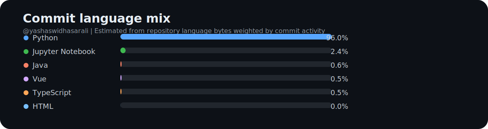

<h1 align="center">Yashaswi Hasarali</h1>
<h3 align="center">AI Engineer | Full Stack Product Engineer for SaaS Platforms</h3>

  
  
  

  <strong>San Jose, CA</strong> • Open to software engineering, full-stack, platform, and AI application roles

  I build AI-powered SaaS products and intelligent product features with <strong>React</strong>, <strong>Node.js</strong>, <strong>Python</strong>, <strong>AWS</strong>, and modern <strong>LLM</strong> tooling.

## Snapshot

- 5+ years building AI-powered SaaS products, MVPs, internal tools, and customer-facing platforms
- Core contributor at `Grantify` across funding intelligence, onboarding flows, dashboards, and automation
- Strong across product engineering, backend systems, data workflows, and LLM application development

## What I Work On

- AI modules and intelligent product features for SaaS platforms
- Full-stack SaaS products and internal dashboards
- AI-assisted user experiences and workflow automation
- Scalable backend systems on AWS
- Data ingestion, matching, and intelligence platforms

## Highlights

- Built AI modules for production SaaS products using `LangChain`, `LangGraph`, `OpenAI`, and `Pinecone`, including semantic retrieval, intelligent parsing, and context-aware answers across 12+ file formats
- Shipped AI-powered workflows on `AWS` with queue-based processing and serverless orchestration for scalable product experiences
- Led prompt engineering and model iteration for live AI features, improving answer quality and reducing hallucinations through benchmark-driven evaluation
- Integrated `Langfuse` for observability, prompt versioning, and faster iteration on customer-facing AI systems
- Developed AI-assisted writing and transcription workflows using `OpenAI` and `AssemblyAI` for real product use cases
- Contributed to a funding intelligence platform combining backend services, LLM scoring, business rules, and product UX to rank relevant opportunities
- Delivered React-based onboarding flows, user dashboards, internal sales tools, analytics integrations, and end-to-end product experiences
- Built ingestion and automation pipelines for scraping, normalization, deduplication, alerting, and downstream business workflows

## Selected Product Work

### `Grantify` | Funding and workflow SaaS platform
- Delivered customer onboarding, company and project profiling, dashboards, and internal sales tooling using `React`, `TypeScript`, and modern data-fetching patterns
- Helped scale backend orchestration for ingestion, matching, notifications, and automation on `AWS`
- Contributed across product workflows that supported funding intelligence, automation, and platform operations

  

### `ParticipACTION` | Fitness challenge Android application
- Link: [Website](https://www.participaction.com/)
- Upgraded an Android `Kotlin` app with new challenge flows and integrations for health and fitness tracking
- Improved product responsiveness and user experience across feature expansion work

### `Unity - Hard Rock Cafe` | Loyalty and rewards mobile experience
- Link: [Google Play](https://play.google.com/store/apps/details?id=com.shre.unitymobile.prod&hl=en_US)
- Spearheaded a `React Native` application for loyalty workflows and user engagement
- Integrated Firebase Crashlytics, Analytics, SFMC notifications, deep linking, and Google Pay

### `SEIU Healthcare Canada` | Community and healthcare mobile application
- Link: [Google Play](https://play.google.com/store/apps/details?id=ca.seiuhealthcare.community)
- Designed and developed the user-facing `React Native` experience for a healthcare community app
- Used `Python`, `Django`, `SES`, and `Elasticsearch` integrations to support notifications, responsiveness, and search

### `Gigmonk` | Marketplace and map-based experience
- Link: [Website](https://gigmonk.com/#/)
- Built and tested multiple `React.js` interfaces and connected backend APIs for a consumer-facing web app
- Integrated `MongoDB` search and Mapbox-powered location experiences for place discovery and tracking

### `Zixa` | Mobile application and identity features
- Link: [Google Play](https://play.google.com/store/apps/details?id=com.exathought.ZIXA)
- Worked on account creation and sign-in using `AWS Cognito` and added document upload, chat, and history flows using `Flutter`
- Supported Android deployment and release work for a smoother production rollout

## GitHub Analytics

  

| Repo Language Mix | Commit Language Mix |
| --- | --- |
|  |  |

| Contribution Streak | Productive Time |
| --- | --- |
|  |  |

  

  

## Experience

### `Grantify` | Full Stack Engineer
`May 2023 - Present` | `San Jose, CA`

- Built AI-powered SaaS features for funding intelligence, document parsing, and internal operations across product, platform, and data workflows
- Shipped scalable backend systems and event-driven automation on `AWS` for ingestion, matching, notifications, and orchestration
- Delivered React applications and internal dashboards using `React`, `TypeScript`, `Vite`, `TanStack`, `Tailwind CSS`, and `tRPC`

### `SUNY Research Foundation` | Senior Research Aide
`Mar 2023 - May 2024` | `Binghamton, NY`

- Developed and maintained data acquisition and processing workflows using `Bonsai` and connected hardware systems
- Supported reliable data capture, transformation, validation, and reproducibility for downstream analysis

### `Binghamton University` | Graduate Teaching Assistant
`Sep 2022 - May 2023` | `Binghamton, NY`

- Guided students in Python programming, debugging, and problem solving
- Supported course delivery, grading, office hours, and technical feedback for a class of 70 students

### `Exathought Technology Pvt Ltd` | Software Engineer
`Jul 2019 - Jul 2022` | `Bengaluru, India`

- Built 5 MVP SaaS and mobile products using `React.js`, `React Native`, and `Flutter`
- Designed scalable application structures, database schemas, and maintainable engineering workflows
- Mentored junior engineers and contributed to delivery standards, product quality, and team collaboration

## Tech Stack

**Languages**  
`Python` `JavaScript` `TypeScript` `Java` `Kotlin` `Dart` `SQL`

**AI and Data**  
`OpenAI` `Claude` `LangChain` `LangGraph` `Pinecone` `Langfuse` `RAG` `Prompt Engineering` `Semantic Search` `OCR` `ETL` `Apache Airflow` `Pandas` `NumPy`

**Frontend**  
`React` `React Native` `Flutter` `Next.js` `Vite` `Tailwind CSS` `TanStack Query` `TanStack Table` `TanStack Form` `Zod` `Redux`

**Backend and APIs**  
`Python` `Node.js` `Express.js` `Django` `tRPC` `REST APIs` `GraphQL` `PostgreSQL` `MySQL` `MongoDB` `DynamoDB` `BigQuery` `Elasticsearch`

**Cloud and DevOps**  
`AWS Lambda` `ECS` `CDK` `SQS` `Cognito` `API Gateway` `CloudWatch` `IAM` `CloudFront` `Docker` `GitHub Actions` `Jenkins` `CI/CD` `Firebase`

**Testing and Quality**  
`Playwright` `Pytest` `Jest` `Vitest` `JUnit` `MyPy` `TDD`

## Education

**Binghamton University - SUNY**  
Master's in Computer Science | `Aug 2022 - May 2024`

**JNN College of Engineering, Shivamogga**  
Bachelor's in Computer Science | `Aug 2015 - Jun 2019`

## Connect

  
  

